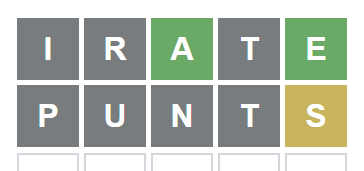

## Project setup

```

npm i

```

## Compile to typescript

```

npm run build

```

## Run tests

```

npm test

```

## Edit the **hints.json** file to match the hints from the screen

For example, if you guessed IRATE followed by PUNTS and the screen is colored as shown, change the json file to match. The words and letters are not case sensitive. You can use the following words:

Exact Match: correct, green, g

Matching Letter in the Wrong Column: present, yellow, y

Not a Match: absent, a, darkgray, d, gray, charcoal, c

Not Yet Filled In: empty, black, b, k

It is not necessary to fill in the empty rows.

Save the file and run "npm run hint" to get the updated hints. It's only necessary to build the first time or after you change the code.



```json

[
    { "ch": "I", "state": "absent" },
    { "ch": "R", "state": "absent" },
    { "ch": "A", "state": "green" },
    { "ch": "T", "state": "absent" },
    { "ch": "E", "state": "green" }
],
[
    { "ch": "P", "state": "a" },
    { "ch": "U", "state": "darkgray" },
    { "ch": "N", "state": "gray" },
    { "ch": "T", "state": "darkgray" },
    { "ch": "S", "state": "yellow" }
]

```

## Get list of hint words

```

npm run hint

```
